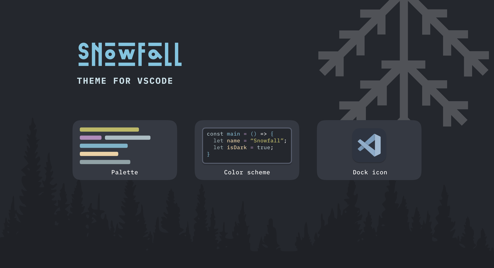

# Snowfall theme for vscode

Bring the calm beauty of winter into your coding environment with the Snowfall Theme for VS Code. Inspired by the serene ambiance of a gentle snowfall, this theme combines soft, muted colors with crisp accents, creating a cozy atmosphere perfect for coding during the colder months.

## Twitter

Follow [@freethinkel](https://twitter.com/freethinkell) on Twitter for the latest updates.

## License

See [LICENSE](./LICENSE) for more information.
